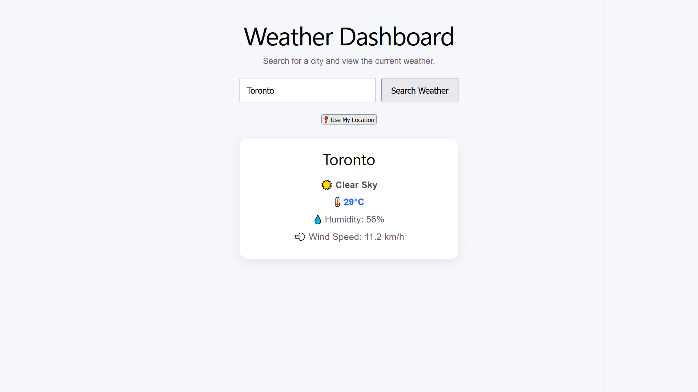

# 🌤️ Weather Dashboard

A responsive Weather Dashboard built with **React**, **TypeScript**, and **Vite** that displays real-time weather information using the Open-Meteo APIs. Users can search for weather by city or use their current location to view live weather conditions.

## 🚀 Live Demo

**Live Website:** https://weather-dashboard-phi-neon.vercel.app/

## 📸 Screenshot



---

## ✨ Features

* Search weather by city name
* Search by pressing the **Enter** key
* Get weather using your current location
* Display:

  * Temperature
  * Weather condition
  * Humidity
  * Wind speed
* Loading indicator while fetching weather
* Error handling for invalid city names
* Responsive design for:

  * Mobile
  * Tablet
  * Laptop
  * Desktop

---

## 🛠️ Built With

* React
* TypeScript
* Vite
* CSS3
* Open-Meteo Geocoding API
* Open-Meteo Weather Forecast API
* Browser Geolocation API

Open-Meteo provides free weather and geocoding APIs that require no API key for non-commercial use.

---

## 📚 What I Learned

While building this project, I practiced:

* React Hooks (`useState`)
* TypeScript interfaces/types
* Event handling
* Conditional rendering
* Asynchronous JavaScript (`async` / `await`)
* Fetching data from REST APIs
* Working with multiple APIs
* Browser Geolocation API
* Error handling using `try`, `catch`, and `finally`
* Refactoring code into reusable helper functions
* Responsive web design using CSS media queries

---

## 💻 Installation

Clone the repository:

```bash
git clone https://github.com/jbloch100/weather-dashboard
```

Navigate into the project:

```bash
cd weather-dashboard
```

Install dependencies:

```bash
npm install
```

Run the development server:

```bash
npm run dev
```

Build for production:

```bash
npm run build
```

---

## 📂 Project Structure

```text
src/
 ├── App.tsx
 ├── App.css
 ├── main.tsx
 └── assets/
```

---

## 🌍 APIs Used

* Open-Meteo Geocoding API
* Open-Meteo Weather Forecast API
* Browser Geolocation API

---

## 📄 License

This project is open source and available under the MIT License.
